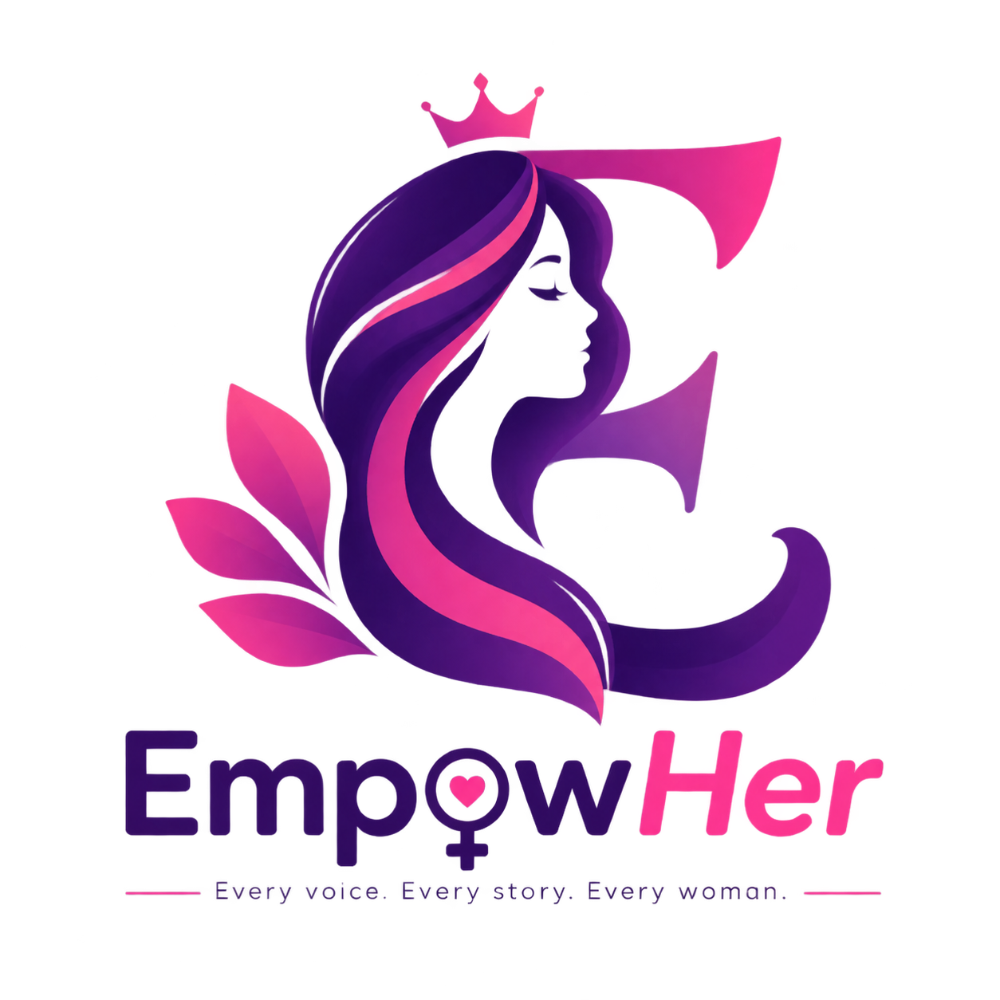
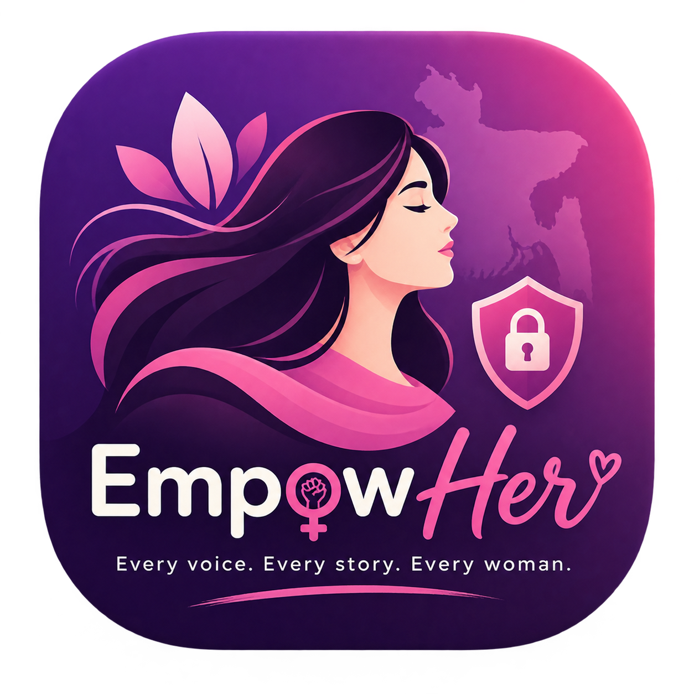
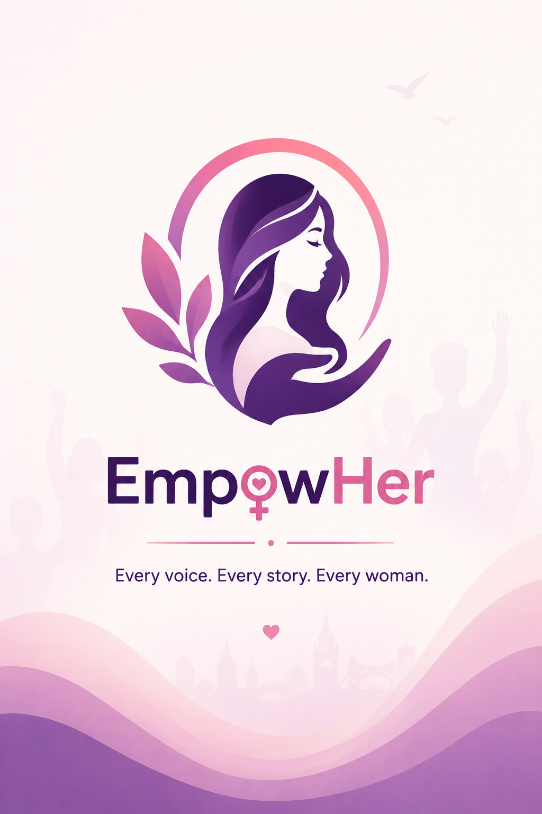

# 🌸 EmpowHer

  

<h3 align="center">
  Every voice. Every story. Every woman.
</h3>

  A women safety and empowerment platform designed to raise awareness,
  report injustice, share experiences, and build a safer community.

---

## 📱 About The Project

**EmpowHer** is a women safety and empowerment Android application
designed with a focus on awareness, reporting injustice, community
support, and personal safety.

The platform provides women with a digital space where they can:

- 🚨 Report harassment, abuse, and injustice
- 📸 Upload evidence and supporting materials
- 📢 Share awareness posts and real-life experiences
- 🛡️ Access safety resources
- 🤝 Seek community support
- 📚 Learn about women's rights and safety

> **Every voice. Every story. Every woman.**

---

## ✨ Features

### 🛡️ Women's Safety

- Emergency SOS
- Trusted contacts
- Safety tips and guidelines
- Personal safety resources

### 🚨 Report & Awareness

- Report incidents
- Upload images, videos, and documents as evidence
- Awareness posts
- Anonymous reporting
- Report tracking

### 💬 Community

- Share experiences
- Awareness content
- Community interaction
- Support other users

### 📚 Awareness Hub

- Women's rights information
- Safety education
- Legal resources
- Self-defense awareness

---

## 🛠️ Technology Stack

- **Kotlin**
- **Android SDK**
- **XML**
- **MVVM Architecture**
- **Coroutines**
- **Retrofit**
- **Room Database**
- **Firebase Authentication**
- **Firebase Firestore**
- **Firebase Storage**
- **Firebase Cloud Messaging (FCM)**

---

## 🎨 Brand Identity

### Logo

  

### App Icon

  

### Splash Screen

  

### Tagline

> **Every voice. Every story. Every woman.**

---

## 📸 Screenshots

Coming Soon...

